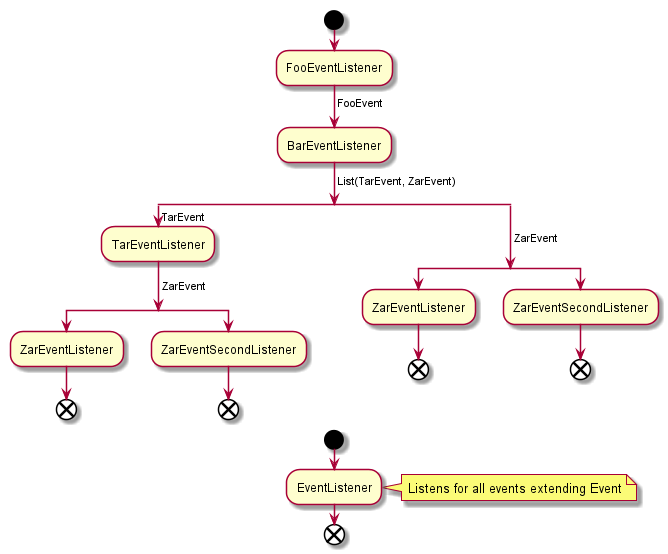

# Spring eventing system demo



```
Output:

pl.grizwold.SpringEventDemoApplication   : Publishing first event...
pl.grizwold.listeners.EventListener      : Processing FooEvent(payload=Kaboom!!)
pl.grizwold.listeners.FooEventListener   : Processing FooEvent(payload=Kaboom!!)
pl.grizwold.listeners.FooEventListener   : Raising BarEvent(payload=Kaboom!!)
pl.grizwold.listeners.BarEventListener   : Processing BarEvent(payload=Kaboom!!)
pl.grizwold.listeners.BarEventListener   : Raising [TarEvent(payload=Kaboom!!), ZarEvent(payload=Kaboom!!)]
pl.grizwold.listeners.EventListener      : Processing TarEvent(payload=Kaboom!!)
pl.grizwold.listeners.TarEventListener   : Processing TarEvent(payload=Kaboom!!)
pl.grizwold.listeners.TarEventListener   : Raising ZarEvent(payload=Kaboom!!)
pl.grizwold.listeners.EventListener      : Processing ZarEvent(payload=Kaboom!!)
pl.grizwold.listeners.ZarEventListener   : Processing ZarEvent(payload=Kaboom!!)
pl.grizwold.listeners.EventListener      : Processing ZarEvent(payload=Kaboom!!)
pl.grizwold.listeners.ZarEventListener   : Processing ZarEvent(payload=Kaboom!!)
pl.grizwold.listeners.EventListener      : Processing BarEvent(payload=Kaboom!!)
```